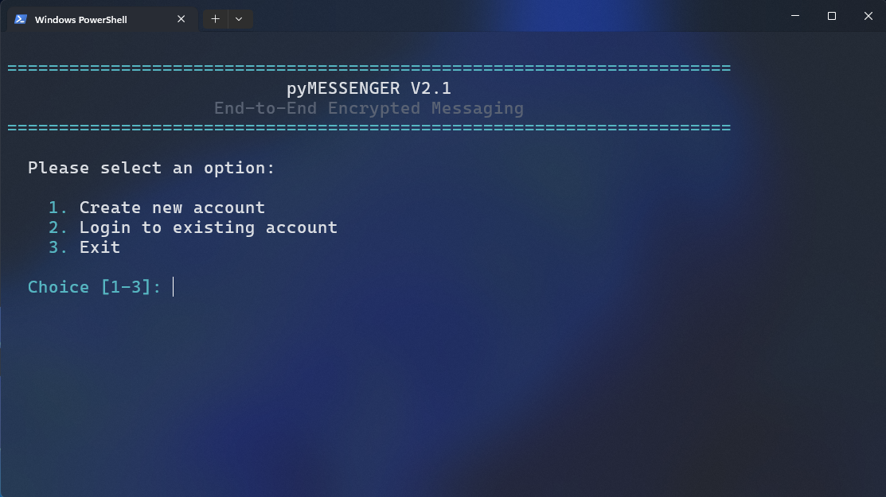
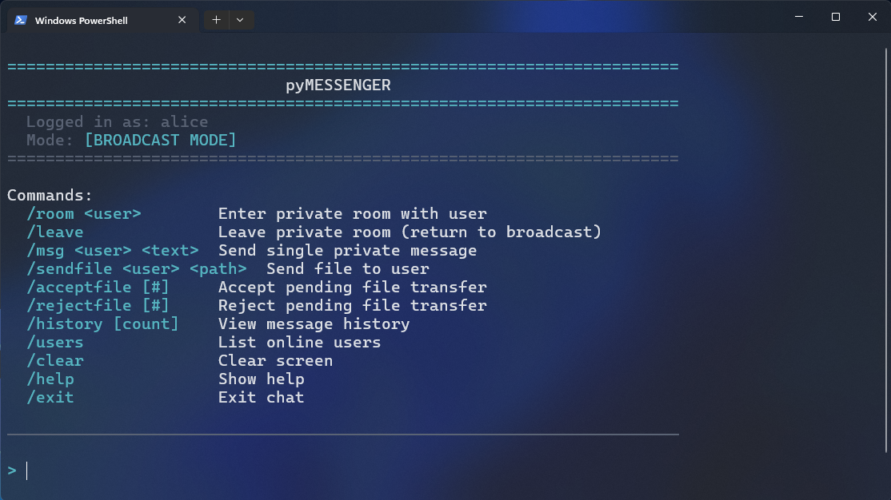

# pyMessenger

**End-to-End Encrypted Messaging System**

A secure, terminal-based messaging application implementing modern cryptographic protocols for private communication.

<p align="center">  
  
  <br>
  <em>Login Screen</em>
</p>

<p align="center">
  
  <br>s
  <em>chat screen</em>
</p>


---

## Overview

pyMessenger is a client-server messaging system that provides secure authentication, Signal-inspired end-to-end encryption, and both broadcast and private messaging capabilities. The server acts as a relay and public key directory: it verifies accounts, distributes public prekey bundles, and forwards encrypted packets, but it never sees plaintext chat content.

---

## Cryptographic Architecture

### Encryption Layers

pyMessenger implements a **defense-in-depth** security model with multiple encryption layers:

```md
┌─────────────────────────────────────────────────────────────┐
│                     APPLICATION LAYER                       │
│  ┌───────────────────────────────────────────────────────┐  │
│  │      Signal-Inspired End-to-End Messaging             │  │
│  │                                                       │  │
│  │  • X25519 identity and prekey exchange                │  │
│  │  • Ed25519-signed prekey bundles                      │  │
│  │  • HKDF-derived session seeds                         │  │
│  │  • AES-256-GCM ratcheting per message                 │  │
│  └───────────────────────────────────────────────────────┘  │
└─────────────────────────────────────────────────────────────┘
                              ▼
┌─────────────────────────────────────────────────────────────┐
│                     TRANSPORT LAYER                         │
│  ┌───────────────────────────────────────────────────────┐  │
│  │            CA-Backed TLS Bootstrap                    │  │
│  │                                                       │  │
│  │  • Private root CA signed server certificate         │  │
│  │  • Hostname verification against ca.crt              │  │
│  │  • Protects login, bundle upload, and packet relay    │  │
│  └───────────────────────────────────────────────────────┘  │
└─────────────────────────────────────────────────────────────┘
                              ▼
┌─────────────────────────────────────────────────────────────┐
│                      SERVER ROLE                            │
│  ┌───────────────────────────────────────────────────────┐  │
│  │  Directory + Relay for Public Bundles and Packets    │  │
│  │                                                       │  │
│  │  • Stores public identity, signed prekey, and        │  │
│  │    one-time prekey bundles                            │  │
│  │  • Forwards signal_session_init and signal_message    │  │
│  │  • Keeps account and presence metadata only           │  │
│  └───────────────────────────────────────────────────────┘  │
└─────────────────────────────────────────────────────────────┘
```

### Key Management

**Client-Side Key Storage:**

Each client stores its long-term authentication keypair and Signal identity material locally with password-based encryption:

```md
User Password
     │
     ▼
[PBKDF2-SHA256] ───────────► Encryption Key (256-bit)
600,000 iterations                    │
Random salt (128-bit)                 │
                                      ▼
                              [AES-256-GCM]
                                      │
                                      ▼
                            RSA Private Key (encrypted)
                                      │
                                      ▼
                         Signal identity + prekey bundle (encrypted)
                                  │
                                  ▼
                            ~/.secure_messenger_client/
                              keys/{username}_private.key
                              signal/{username}_signal.key
```

**Server-Side Storage:**

The server never has access to private keys. It only stores:
- Hashed passwords (PBKDF2-SHA256, 100,000 iterations)
- Public authentication keys (RSA-2048)
- Public Signal bundles (identity key, signed prekey, one-time prekeys)
- Account metadata

---

## Authentication System

### Challenge-Response Authentication

pyMessenger uses a secure challenge-response protocol that avoids transmitting passwords over the network after initial registration:

```md
┌────────────┐                                    ┌────────────┐
│   CLIENT   │                                    │   SERVER   │
└─────┬──────┘                                    └─────┬──────┘
      │                                                 │
      │  1. Login Request (username + public key)       │
      ├────────────────────────────────────────────────►│
      │                                                 │
      │                                                 │ Generate
      │                                                 │ Random
      │                                                 │ Nonce
      │                                                 │
      │  2. Challenge (nonce + salt)                    │
      │◄────────────────────────────────────────────────┤
      │                                                 │
      │ Derive password key                             │
      │ from password + salt                            │
      │                                                 │
      │ response = HMAC-SHA256(                         │
      │   key=password_key,                             │
      │   msg=nonce                                     │
      │ )                                               │
      │                                                 │
      │  3. Response (HMAC signature)                   │
      ├────────────────────────────────────────────────►│
      │                                                 │
      │                                                 │ Verify
      │                                                 │ HMAC with
      │                                                 │ stored key
      │                                                 │
      │  4. Session Token (if valid)                    │
      │◄────────────────────────────────────────────────┤
      │                                                 │
```

**Security Features:**

1. **No Password Transmission**: Password never sent over network after registration
2. **Replay Protection**: Each nonce is single-use and time-limited (5 minutes)
3. **Salt-Based Key Derivation**: Prevents rainbow table attacks
4. **Constant-Time Comparison**: Prevents timing attacks on response verification
5. **Rate Limiting**: 5 failed attempts trigger 15-minute account lockout

---

## End-to-End Message Encryption

### Signal-Inspired Session Setup

Messages use a Signal-like bootstrap and ratchet flow:

```md
1. CLIENT LOGIN
  - The client uploads a public bundle containing its identity key,
    signed prekey, and one-time prekeys.

2. SENDER REQUESTS PEER BUNDLE
  - The sender asks the server for the recipient's public bundle.
  - The server returns the bundle and consumes one one-time prekey.

3. INITIAL SESSION DERIVATION
  - The sender combines X25519 inputs from the peer bundle with its own
    identity key material.
  - HKDF derives a session seed in an X3DH-style handshake.

4. SESSION INIT PACKET
  - The first packet is sent as `signal_session_init`.
  - It carries the first encrypted message and establishes the session state.

5. RATCHETED MESSAGES
  - Subsequent packets are sent as `signal_message`.
  - Each message uses AES-256-GCM with a per-message derived key.
```

### Decryption Process

```
RECIPIENT RECEIVES A SIGNAL PACKET
        │
        ▼
1. Match the packet to the stored peer session
        │
        ▼
2. If this is a session init packet, derive the shared seed
  using the recipient's identity key, signed prekey, and one-time prekey
        │
        ▼
3. Decrypt the payload with AES-256-GCM
        │
        ▼
4. Advance the message ratchet and update the session counter
```

This is intentionally Signal-inspired rather than a full Double Ratchet implementation: it uses prekey bundles, session setup, and symmetric ratcheting, but it does not yet implement the full asynchronous recovery and out-of-order handling of production Signal.

---

## Security Features

### Password Security

| Feature | Implementation |
|---------|----------------|
| **Key Derivation** | PBKDF2-SHA256 with 100,000 iterations |
| **Salt** | 256-bit random salt per password |
| **Storage** | Hashed password (never plaintext) |
| **Transmission** | Password only sent during registration (over TLS) |

### Authentication Security

| Feature | Implementation |
|---------|----------------|
| **Protocol** | Challenge-response (HMAC-based) |
| **Challenge Timeout** | 5 minutes |
| **Rate Limiting** | 5 attempts per 15-minute window |
| **Account Lockout** | 15 minutes after 5 failed attempts |
| **Timing Attack Prevention** | Constant-time comparisons |
| **Username Enumeration Prevention** | Consistent response times |

### Message Security

| Feature | Implementation |
|---------|----------------|
| **Encryption Algorithm** | AES-256-GCM |
| **Key Exchange** | X25519 + X3DH-style prekey handshake |
| **Key Lifetime** | Per-session ratchet with per-message keys |
| **Authentication** | AEAD with 128-bit tag |

### Transport Security

| Feature | Implementation |
|---------|----------------|
| **Protocol** | TLS 1.2+ |
| **Certificate** | Private CA-signed X.509 |
| **Cipher Suites** | ECDHE+AESGCM, ECDHE+CHACHA20 |
| **Perfect Forward Secrecy** | Ephemeral key exchange (ECDHE/DHE) |

---

## Installation

### Prerequisites

```bash
# Python 3.8 or higher required
python3 --version
```

### Install Dependencies

```bash
pip install -r requirements.txt
```

**Required packages:**
- `pycryptodome`: Legacy RSA auth keys and chunk/file-transfer crypto
- `cryptography`: SSL/TLS certificate generation and Signal-style session crypto
- `prompt_toolkit`: Enhanced terminal UI

### Generate SSL Certificates

```bash
python3 generate_certificates.py
```

This creates a private root CA and a CA-signed server certificate in `~/.secure_messenger/certs/`:
- `ca.crt`: Root certificate authority certificate to distribute to clients
- `ca.key`: Root certificate authority private key, keep this secret
- `server.crt`: Server certificate signed by the root CA (valid for 365 days)
- `server.key`: Server private key

---

## Usage

### Start the Server

```bash
python3 server.py
```

**Optional arguments:**
- `--host <address>`: Bind address (default: 0.0.0.0)
- `--port <port>`: Listen port (default: 1315)
- `--cert-host <name-or-ip>`: Hostname or IP to place in the server certificate SAN. May be repeated.

### Start a Client

```bash
python3 client.py
```

**Optional arguments:**
- `--host <address>`: Server address (default: localhost)
- `--port <port>`: Server port (default: 1315)
- `--ca-cert <path>`: Path to the trusted root CA certificate (default: `~/.secure_messenger/certs/ca.crt`)

### First-Time Setup

1. **Create Account**: Choose option 1 to register
2. **Set Password**: Minimum 6 characters
3. **Keys Generated**: RSA auth keypair plus Signal identity and prekeys are created and stored locally
4. **Certificate Trust**: Client validates the server using `ca.crt`
5. **Bundle Upload**: After login, the client publishes its public Signal bundle to the server automatically
6. **Login**: Use same credentials to authenticate

### Messaging Modes

**Broadcast Mode (Default):**
- Messages sent to all online users
- Public conversation

**Private Room Mode:**
```bash
/room <username>  # Enter private room with user
/leave            # Return to broadcast mode
```

**Single Private Message:**
```bash
/msg <username> <message>  # One-time private message
```

### Available Commands

| Command | Description |
|---------|-------------|
| `/room <user>` | Enter private room with user |
| `/leave` | Leave private room |
| `/msg <user> <text>` | Send single private message |
| `/sendfile <user> <path>` | Send file to user (encrypted) |
| `/acceptfile [#]` | Accept pending file transfer |
| `/rejectfile [#]` | Reject pending file transfer |
| `/users` | List online users |
| `/history [count]` | View message history (default: 20) |
| `/clear` | Clear screen |
| `/help` | Show help |
| `/exit` | Exit application |

### Mention System

Users can be mentioned in messages using `@username`:
- Mentions highlighted in sender's and recipient's view
- Visual notification when you're mentioned

### File Sharing

**Send Files:**
```bash
/sendfile alice ~/Documents/report.pdf
```

**Receive Files:**
- Files automatically saved to `~/.secure_messenger_client/files/received/`
- Accept or reject incoming files with `/acceptfile` or `/rejectfile`
- Files are encrypted end-to-end in 64KB chunks
- Progress tracking during transfer

**Security Model:**
- **End-to-end encrypted** - Server cannot decrypt files
- **Zero server storage** - Files never saved on server
- **Chunk-based transfer** - Each 64KB chunk separately encrypted
- **Per-chunk keys** - Unique AES-256 key per chunk
- **Perfect forward secrecy** - RSA-wrapped keys for each chunk

**Features:**
->  End-to-end encrypted (AES-256)
-> Automatic folder management
-> Accept/reject system
-> Real-time progress updates
-> Files prefixed with sender username

See [FILE_SHARING.md](FILE_SHARING.md) for complete documentation.

---

## File Structure

```
pyMessenger/
├── client.py                 # Client application
├── server.py                 # Server application
├── user_store.py            # User database and authentication
├── signal_protocol.py       # Signal-inspired session and bundle crypto
├── generate_certificates.py  # Private CA and server certificate generator
├── requirements.txt         # Python dependencies
├── README.md               # This file
├── FILE_SHARING.md         # File sharing documentation
└── IMPLEMENTATION_SUMMARY.md # Technical implementation details

ON LINUX/UNIX:
User Data:
~/.secure_messenger_client/
├── keys/
│   └── {username}_private.key  # Encrypted private key
├── signal/
│   └── {username}_signal.key     # Encrypted Signal identity bundle
└── files/
    ├── received/               # Files received from others
    └── sent/                   # Copies of sent files

ON WINDOWS:
User Data:
C:\Users\[YOUR_USER]\.secure_messenger_client\
├── keys/
│   └── {username}_private.key  # Encrypted private key
├── signal/
│   └── {username}_signal.key     # Encrypted Signal identity bundle
└── files/
    ├── received/               # Files received from others
    └── sent/                   # Copies of sent files

~/.secure_messenger/
├── certs/
│   ├── ca.crt            # Root certificate authority certificate
│   ├── ca.key            # Root certificate authority private key
│   ├── server.crt           # Server certificate
│   └── server.key           # Server private key
├── logs/
│   └── security.log         # Security audit log
├── keys/
│   └── (server-stored keys) # Public keys only
└── users.json              # User database
```

---

## Security Considerations

### Threat Model

**Protected Against:**
- Passive network eavesdropping (TLS + E2EE)
- Message tampering (authenticated encryption)
- Server compromise (E2EE, server never sees plaintext)
- Brute force attacks (rate limiting, PBKDF2)
- Timing attacks (constant-time comparisons)
- Replay attacks (nonce-based challenges)

---

## Technical Specifications

### Cryptographic Algorithms

| Component | Algorithm | Key Size | Notes |
|-----------|-----------|----------|-------|
| Asymmetric | X25519 / Ed25519 / RSA-OAEP | 25519 / 2048-bit | Signal sessions and legacy auth |
| Symmetric | AES-GCM | 256-bit | Message encryption |
| Hash | SHA-256 | 256-bit | All hashing operations |
| KDF | HKDF-SHA256 / PBKDF2-SHA256 | 256-bit output | Session derivation and password storage |
| MAC | AEAD tag / HMAC-SHA256 | 128-bit / 256-bit | Message integrity and challenge-response |

### Protocol Details

**Message Format:**
```json
{
  "type": "signal_send",
  "from": "sender_username",
  "target": "recipient1",
  "packet": {
    "header": {
      "from": "sender_username",
      "to": "recipient1",
      "session_id": "<base64-encoded>",
      "counter": 1,
      "is_private": true
    },
    "nonce": "<base64-encoded>",
    "ciphertext": "<base64-encoded>"
  }
}
```

**Bundle Relay Format:**
```json
{
  "type": "signal_bundle_upload",
  "bundle": { "...": "public bundle payload" }
}
```

```json
{
  "type": "signal_bundle_request",
  "target": "recipient1",
  "request_id": "<random-id>"
}
```

```json
{
  "type": "signal_session_init",
  "from": "sender_username",
  "target": "recipient1",
  "packet": { "...": "session init payload" }
}
```

**All binary data is Base64-encoded for JSON transport.**

---

## License

MIT Licence

---

## Authors

[Mohamed G.](https://mohamedg.me) - M. M. Sabaly
